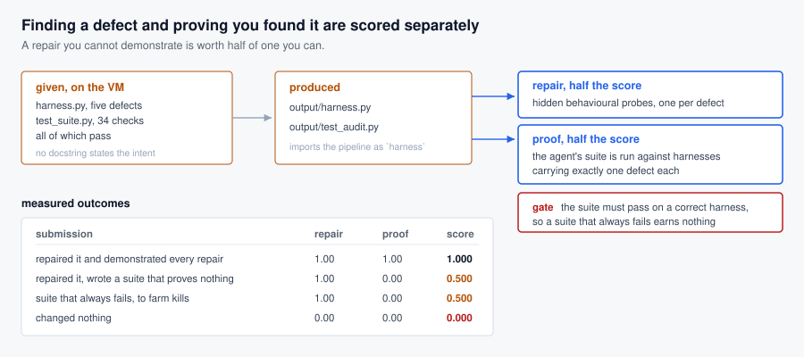

# Evaluation Harness Leakage Audit

A readmission risk pipeline reports a good headline score and a treatment arm
that beats its control. It runs. Its 34-check test suite passes. Every number it
publishes is wrong.

The agent must repair it **and prove the repairs**, where proving means producing
a test suite that fails on a pipeline still carrying the defect. Half the score
is the repair, half is the proof.

That second half is the point. Benchmarks measure whether an agent can fix
something. This one measures whether it can show that it did.

## How grading works



Nothing reads the agent's source. A repair is judged by hidden behavioural
probes, so a defect counts as fixed when the pipeline stops exhibiting it,
however the fix was phrased. A test is judged by what it detects.

## The premise: a green suite that constrains nothing

The shipped suite runs 34 checks across the dataset, the split, preprocessing,
the model, the metrics and the report. It verifies shapes, ranges, determinism,
reproducibility, that training beats an untrained model, and that the treatment
arm beats the ablated control.

**It passes on all seven builds**, including the one carrying all five defects.
That is measured, not asserted. An agent is handed a green suite and has to work
out that green means nothing here.

## The five defects

Each leaves the pipeline running and its numbers plausible.

| defect | what it corrupts |
|---|---|
| preprocessing fitted on train and test together | test statistics reach the model |
| the split shuffles rows, not groups | a patient appears in every split, so the model is scored on patients it trained on |
| early stopping selects the epoch on test | the reported number was chosen knowing the set it is reported on |
| the headline becomes plain accuracy | at a 12% positive rate, always predicting "no" scores 0.86 |
| both arms share one generator | the difference between them depends on the order they ran in |

None of them is stated in a docstring. The reference's explanatory comments are
stripped from the build the agent receives, because prose that describes the
intended behaviour above the defective code hands over every answer.

## Measured, not asserted

Through the same grader the benchmark uses:

| submission | repair | proof | score |
|---|---|---|---|
| repaired and demonstrated every repair | 1.00 | 1.00 | **1.000** |
| repaired it, suite proves nothing | 1.00 | 0.00 | **0.500** |
| suite that always fails, to farm kills | 1.00 | 0.00 | **0.500** |
| changed nothing | 0.00 | 0.00 | **0.000** |

Row two is the discrimination the task exists for. Row three is the anti-gaming
control: a suite that always exits non-zero would kill every mutant, so the kills
half is gated on the suite passing a known-correct harness.

## Probe independence

The probes are not fully independent: a harness that still selects its epoch on
test also fails the preprocessing probe, because both are detected by perturbing
the test set. The cross-talk runs in the conservative direction. An agent that
fixes one defect but not another gets no credit until both are fixed, so the
score understates partial progress and never overstates it, and it stays monotone
because fixing defects only ever adds passes.

## Running it

```
uv run pytest tests/tasks/test_eval_harness_leakage_audit.py
```

Nine checks, including that the shipped suite passes on the defective build, that
the starter carries all five defects, that every probe detects its own defect,
that no giveaway prose reaches the VM, and the four scoring outcomes above.

Self-contained: standard library only, no baked image data, no task-data pull, no
`requiredSystemPackages`, no network. The pipeline runs in under a second.

## Difficulty

Measured once so far, and not claimed as a tier: ALE runs difficulty
classification as one of its own review controls.

Codex CLI 0.145.0, `gpt-5.6-sol` at `xhigh`, staged through this task's own
`start()` and scored by its own grader:

| elapsed | repair | proof | score |
|---|---|---|---|
| 387 s | **1.00** | **0.00** | **0.500** |

**That is not "half the defects found".** It found and repaired all five, quickly.
Every probe passes on its harness. The half it lost is the half this task exists
to measure.

Its suite runs six checks. Five are correct audits and pass on the reference:
group isolation, preprocessing fitted on training rows only, early stopping
driven by validation, an independent per-arm generator, and an imbalance-aware
headline. It failed on a sixth check it added itself, asserting that even-sized
columns must use the mathematical median. The reference uses the upper of the two
middle values, an equally valid convention that this task never specifies.

So it wrote a suite that fails on a correct pipeline that merely differs from its
own. For a suite whose purpose is auditing someone else's harness that is fatal,
and the prompt states the requirement.

**A repair-only framing would have scored this submission 1.000 and called it
solved.** The proof half caught that its verification does not transfer.

One caveat against this design, recorded rather than left to be found: the gate is
binary, so a single over-specified assertion unrelated to any defect zeroes the
proof half however good the rest of the suite is. That is the same line a real
audit suite faces, but a future variant could decompose the suite check by check.
The current exit-code interface cannot.
