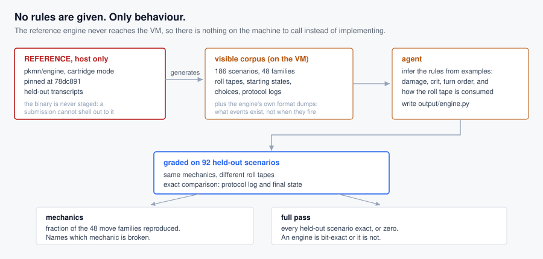

# Battle Engine Reconstruction From Behaviour

Reimplementing a system whose specification is lost, from the behaviour of the
system itself, is an ordinary and expensive engineering job. This task is that,
made exactly checkable.

The agent is given a labelled corpus of battles from a deterministic Generation I
battle engine and **no rules at all**: no damage formula, no critical-hit rule, no
random-number consumption order, no turn order. It must write an engine that
reproduces held-out battles bit for bit.

Comparison is exact on both the protocol log and the final battle state. No
tolerance, no rubric, no model in the grading path.

## How grading works



**The reference binary is never staged.** That is deliberate, and it was the
decisive packaging choice. Shipping the oracle so the agent could probe it freely
is the more natural design and it is hackable: a submission can shell out to the
oracle, or embed all 276 KB of it in its own source, and score perfectly having
implemented nothing. Deleting the oracle before grading does not help, because
the submission can carry a copy. So the agent gets data, not a callable engine.

The cost of that choice is real: the agent cannot test a hypothesis against a
fresh input, only against the corpus it was given. That is the price of a corpus
that cannot be gamed, and it is a tradeoff rather than a free win.

## What is given, and what is withheld

| given | withheld |
|---|---|
| 186 scenarios: roll tape, starting state, both choices, protocol log, final state | every rule |
| `docs/protocol.json`: the names of every event the engine can emit | when any of them fire |
| `docs/layout.json`: byte offsets and sizes of the battle state | what changes any field |

The two documents are emitted by the engine's own `dump` tool, so the split
between format and rule is drawn by the upstream project rather than by us.

## Scoring

Two numbers, because they answer different questions.

- **full_pass**: every held-out scenario exact, or zero. An engine is bit-exact or
  it is not, and this is the headline.
- **mechanics**: mean over families of the fraction reproduced. One family is one
  move, so this reads as "how many of the 48 mechanics did it get right".

Measured through the same grader the benchmark uses:

| candidate | scenarios | mechanics | full pass | families flagged |
|---|---|---|---|---|
| reference engine | 140/140 | 1.000 | 1 | none |
| one localized bug | 135/140 | 0.965 | 0 | **Wrap 0.00, Pin Missile 0.33** |
| empty output | 0/140 | 0.000 | 0 | all 48 |

The last column is the point. The grader **names the broken mechanic** rather
than returning a scalar. A corpus of random full-length battles rated that same
build 0.542 and could say nothing about why.

## Design properties, each verified by a test

- **Every graded mechanic is demonstrated.** The corpus is split by roll tape
  within each family, never by family. A family-level split would grade mechanics
  the agent had never seen an example of, and a move-specific effect cannot be
  inferred from never observing it: that is unsolvable rather than hard.
- **Families are isolated by construction.** Each scenario is one Pokemon a side,
  so a faint ends the battle instead of handing the move script to a replacement.
  At six a side, 65% of scenarios leaked into a neighbouring family at cap 12, and
  no shorter cap fixed it.
- **No two families are indistinguishable.** A transcript shared across different
  families would mean two mechanics cannot be told apart. Measured: zero.
- **Nothing held out reaches the VM.** No graded scenario id, no graded
  transcript.

## Roster

48 moves chosen for structural distinctness rather than count, covering partial
trapping, lock-in, charge, multi-hit, high-crit, one-hit KO, recoil, drain,
self-KO, screens, Haze, Mist, Disable, Mimic, Conversion, Bide, Rage, Leech Seed,
fixed damage, Super Fang, all four status classes, and eight secondary-effect
chances: 47 of the engine's 68 move effects.

Twelve species cover all 15 Generation I types with base Speed from 30 to 140.
Speed matters because the critical-hit rate is derived from it, and only a
species at 128 or above reaches the clamp in that calculation.

Teams are synthetic. The engine does not enforce learnsets, and these movesets
are chosen for mechanical coverage, not legality.

## Reference provenance

Every transcript is produced by executing `pkmn/engine` (MIT) built in
cartridge-accurate mode at commit `78dc891`. No transcript is hand written. The
ground truth is precisely "whatever that pinned binary does": it is a well
defined, deterministic, reproducible authority, and it is not a claim of fidelity
to 1996 hardware. See [ATTRIBUTION.md](ATTRIBUTION.md).

No Nintendo code, no ROM, no game assets.

## Running it

```
uv run pytest tests/tasks/test_gen1_battle_engine_reconstruction.py
```

Self-contained: no baked image data, no task-data pull, no
`requiredSystemPackages`, no network. `start()` writes 1.3 MB of JSON inline.

To rebuild the corpus from source, see [NOTES.md](NOTES.md).

## Difficulty

Measured three times, and not claimed as a tier: ALE runs difficulty
classification as one of its own review controls.

Codex CLI 0.145.0, `gpt-5.6-sol` at `xhigh`, staged through this task's own
`start()` and scored by its own grader:

| run | elapsed | submission | scenarios exact | mechanics | full pass |
|---|---|---|---|---|---|
| 1 | 5528 s | 30,545 B | 0 / 274 | **0.000** | 0 |
| 2 | 5716 s | 34,632 B | 1 / 274 | **0.004** | 0 |
| 3 | 8148 s | 40,920 B | 0 / 274 | **0.000** | 0 |

One scenario out of 274, once, across three runs totalling five and a half hours
of agent time. That is noise rather than partial progress.

The zeros were checked before being reported, because an exact zero is the
signature of a broken interface rather than a hard task. It is not that here: every
scenario exited 0, every one produced a well-formed transcript with a `state` line,
and none timed out. The submissions reproduce the switch-in and then diverge on the
first damaging turn, on the damage values. They are working engines that reproduce
essentially none of the held-out scenarios. All three break on the same eight
families, which is what a wrong core damage formula looks like.

**The comparison that makes this interesting** is with the sibling task in this
contribution. On `computing_math/lockstep_desync_repro`, the same agent scored
1.000 with a full specification (315 s) and 1.000 again with the specification
deleted (2374 s). Holding "no specification" constant and varying only the size
and subtlety of the mechanics flips the outcome from 1.000 to 0.000.

Difficulty here comes from the mechanical surface, not from withholding
documentation.

Two caveats worth stating. Zero
is a floor and cannot separate hard from unreasonable, though the task is
solvable in principle since the reference engine scores 1.000 through the same
grader path. And the `mechanics` metric only discriminates above a threshold: a
submission whose core damage formula is wrong fails every family at once, so the
per-family diagnostic becomes useful only once the core is right.
