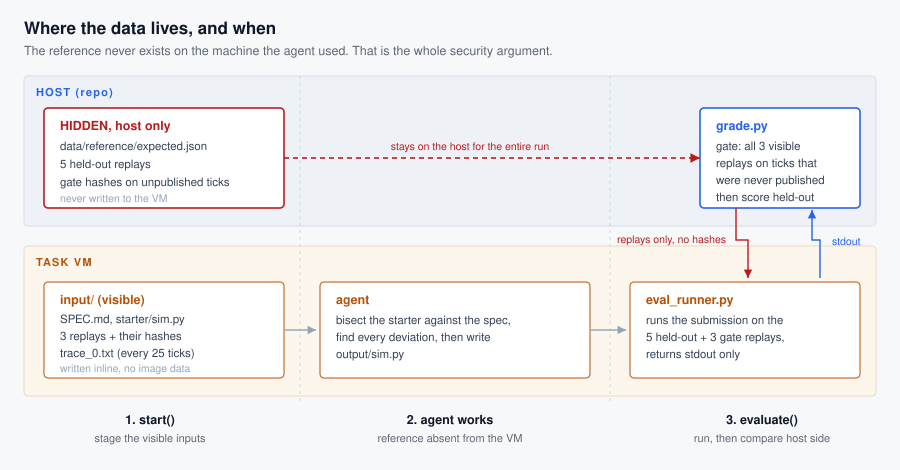

# Lockstep Replay Conformance

A lockstep game simulator replays a recorded stream of player inputs and must
arrive at exactly the same state on every client, on every tick. One rounding
mode, one iteration order, one random draw out of sequence, and the match
desynchronises. Studios lose weeks to this class of bug.

The agent is given a simulator that **does** desynchronise, the rules it is
supposed to follow, three recorded matches with their correct state hashes, and
a hash trace to bisect against. It must produce a simulator that reproduces
held-out recordings **bit for bit**.

Comparison is exact. There is no tolerance, no rubric, and no model in the
grading path.

## Why it is hard

The starter runs, produces well-formed output, and looks plausible. It departs
from the specification in five places, each a real desync class, and each
invisible until a specific condition occurs deep into a match:

| deviation | why it hides | first diverges (tick) |
|---|---|---|
| integer division floors instead of truncating toward zero | identical until an operand goes negative **with a remainder**, which needs stacked armor shred | 1150 - 2025 |
| effect expiry runs after the attack phase instead of before | needs an effect to expire on the same tick it would have applied | 1500 - 2375 |
| a crit roll is skipped when the cached target already died this tick | needs two attackers to hit the same target in one tick, the first killing it | 1725 - 2225 |
| target acquisition walks the lane container in storage order, not by entity id | needs a distance tie **after** a swap-remove has scrambled the container | 2625 - 3500 |
| the team damage scoreboard never wraps to 32 bits | needs the counter to pass 2^31, which happens near the end of a match | 7575 - 8675 |

Ranges are measured across all eight shipped replays. Every deviation fires in
eight of eight.

## How grading works



The property that makes this unhackable: **the reference never exists on the
machine the agent used.** `start()` writes only visible inputs. The held-out
replays are pushed during `evaluate()`, after the agent has exited, and the
expected hashes are never written to the VM at all. Comparison happens host
side, against repo-local assets.

Two scoring stages:

- **Gate.** The three agent-visible replays are re-run on a checkpoint tick set
  that is published nowhere. A submission that memorised the hashes in
  `expected_*.json` fails here instead of passing. Failing the gate scores 0.
- **Score.** Past the gate, the mean fraction of leading checkpoints reproduced
  across five held-out replays. Leading, because a lockstep simulation that has
  desynchronised stays desynchronised, so crediting a later coincidental match
  would be wrong.

The gate covers the first 44% of a match by design. Four deviations diverge by
tick 3500 and the fifth no earlier than 7575, so the gate certifies that the
opening of every visible match reproduces on unpublished ticks, while the
held-out score measures how deep into a match the repair holds.

## Measured, not asserted

Every row below was produced by running the candidate through the same grader
the benchmark uses (`assets/controls.py`):

| submission | gate | held-out | score |
|---|---|---|---|
| reference simulator (oracle) | pass | 1.000 | **1.000** |
| all repaired except the 32-bit register | pass | 0.825 | **0.825** |
| all repaired except candidate ordering | fail | 0.325 | 0.000 |
| starter, unmodified | fail | 0.125 | **0.000** |
| empty output | fail | 0.000 | 0.000 |
| crashes on start | fail | 0.000 | 0.000 |
| replays the published visible hashes | fail | 0.000 | 0.000 |
| replays the published 25-tick trace | fail | 0.000 | 0.000 |

The unmodified starter reaches 0.125 on held-out checkpoints and still scores 0.
That is what the gate is for: without it, submitting the provided file unchanged
would earn a floor.

The trace-replay row exists because the task's own test suite found the shortcut
it describes. `trace_0.txt` carries a hash every 25 ticks, and the gate ticks
were originally all multiples of 25, so one replay's gate was answerable by
lookup. The ticks were moved off that grid and the shortcut is now a standing
control.

## Reference provenance

Every expected hash comes from an actual execution of `assets/sim_reference.py`
over the shipped replays. No hash is hand written. Each replay is recorded by
driving that simulator with a scripted policy, and the build asserts that
replaying the recording open loop reproduces it exactly.

## Running it

```
uv run pytest tests/tasks/test_lockstep_desync_repro.py
uv run python -m ale_run run <exp>.yaml --task computing_math/lockstep_desync_repro --dry-run
```

The test file drives the real `start()` and `evaluate()` against a local session
that runs bash and keeps files on disk, so staging, the leak check, the on-VM
runner and the grader are all exercised without provisioning a VM.

To rebuild the shipped data from source, and to see the invariants the build
refuses to ship without, see [NOTES.md](NOTES.md).

## Cost to run

Self-contained: no baked image data, no task-data pull, no
`requiredSystemPackages`, no network. `start()` writes 90 KB of inputs inline.
Runs on `cpu-free-ubuntu` under any provider including Docker. Grading runs the
submission eight times at 300 s each, and the reference completes a replay in
about 5 s.
