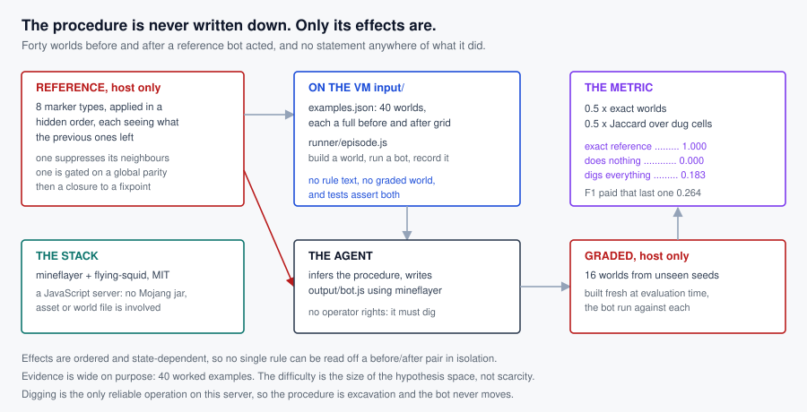

# Reproduce An Excavation Procedure From Its Effects

A bot applied a fixed procedure to a series of block worlds. The agent is shown each
world before and after, is told nothing about what the bot did, and must write a bot
that reproduces the same transformation on worlds it has never seen.

The examples are the only statement of the procedure that exists. No description of
it reaches the VM, and a test asserts that.

## How it fits together



## What the agent gets

```
input/
  examples.json      worlds recorded before and after the reference bot acted
  runner/episode.js  build a world, run a bot against it, record the result
  runner/README.md   how to invoke it
```

Each world is a 9x9 arena, one layer, addressed by offset from its centre as
`"dx,dz"` with both from -4 to 4. Cells start as `grass_block` apart from a
scattering of markers. `before` and `after` are the full grids.

## What it writes

`output/bot.js`, a CommonJS module exporting `run(arena)`:

```js
module.exports = { run: async function (arena) { /* connect, act, return */ } }
```

`arena` carries `{centre, size, host, port, version, username}`. The bot connects
with `mineflayer` and **has no operator rights**, so server commands are
unavailable: whatever the procedure does, the bot has to do by acting in the world.

## How it is graded

Held-out worlds, built from seeds the agent never sees. For each, the arena the
agent's bot leaves is compared with the arena the reference bot left.

```
reward = 0.8 * (fraction of worlds reproduced exactly) + 0.2 * (mean Jaccard over dug cells)
```

Measured through the shipped grader:

| submission | reward |
|---|---|
| the reference world states | **1.000** |
| Codex `gpt-5.6-sol` at `xhigh`, two runs | **0.141 / 0.127** |
| a bot that digs the whole arena | 0.048 |
| a bot that digs all grass and leaves the markers | 0.044 |
| a bot that does nothing | **0.000** |
| no submission, or unparseable results | 0.000 |

Forty to forty-four minutes of agent time per run, and **zero of sixteen worlds
reproduced exactly in either run** (overlap 0.64 and 0.71). The pass threshold
recorded in the task card is 0.75.

Exactness carries 0.8 because reproducing a procedure means reproducing it. The
overlap term is kept at 0.2 so the task distinguishes a solver that has most of the
procedure from one that has none, rather than collapsing to a flat zero.

The partial half exists so progress is visible without paying for a shortcut. Two
metrics were rejected by measurement. Per-cell accuracy hands a bot that does
nothing about half, because most of the arena is untouched anyway. F1 over dug cells
fixes that but rewards recall enough that digging the entire arena scores 0.53 on it,
and 0.26 overall. Jaccard charges that bot for every cell it should not have touched
and brings it down to 0.18.

## Two earlier versions were too easy, and what fixed it

A first version used a 7x7 arena, three marker types and one conditional exception.
A strong agent scored **1.000 in 1100 s on its first attempt**, reproducing all
eight graded worlds exactly, and its submission reconstructed the rule outright.

The failure was structural, not a matter of tuning. Each marker's effect was
independent and additive, so every rule could be inferred on its own from a
before/after pair, and three rules over 49 cells is a lookup table with a footnote.
Marker density had been tuned so the conditional appeared nine times in the
examples; it made no difference.

The second version made effects ordered and state-dependent and widened the surface
to eight marker types. That took a strong agent to 0.471 and 0.509, with 1-2 of 16
worlds exact but **overlap still 0.88**. Three further rule redesigns were then
explored in a standalone simulator, scored by how much overlap a solver keeps when
it has recovered every rule but one:

| design | near-miss overlap |
|---|---|
| the shipped v2 rules | 0.808 |
| a cellular-automaton closure, 1 to 4 rounds | 0.81 rising to **0.94** |
| directional flood rules | 0.83 to 0.87 |
| **a global gate on the intermediate state** | **0.683** |

The cellular automaton made the task *easier*: flooding the arena erases differences
rather than amplifying them. And the reason nothing local helped is structural.
**Jaccard is bounded below by the share any one rule contributes**, so with eight
rule types a solver missing one keeps about 0.88 whatever sits underneath. The
metric had to change as well as the rules.

This version therefore changes both:

- **Effects are ordered and state-dependent.** The procedure applies its rules in a
  fixed hidden sequence and each one sees the world as the previous ones left it.
  One rule fires only if none of its neighbours is already cleared, another runs
  until it meets a cleared cell. No effect can be read off in isolation.
- **The surface is larger.** Eight marker types rather than three, including one
  that suppresses its neighbours and one that depends on a global parity.
- **A global gate.** The procedure runs a first phase, measures how much of the
  arena it cleared, and that count selects which second phase runs. One missed rule
  in the first phase can move the count across the threshold and change every cell
  the second phase touches. Both branches occur on both sides of the split (22 dense
  and 18 sparse worlds in the examples, 11 and 5 in the graded set) and a test
  asserts it, so the gate cannot quietly become untestable.
- **Exactness dominates the score**, 0.8 against 0.2.

Evidence was widened rather than narrowed: 40 worked examples instead of 8, because
the difficulty should come from the size of the hypothesis space, not from starving
the agent of data. That is the shape `gen1_battle_engine_reconstruction` has, where
638 worked examples and 48 interacting mechanics still yield 0.000.

## Why this shape

Three findings from earlier tasks in this contribution decided it.

- **No specification is shipped.** On `lockstep_desync_repro` a strong agent scored
  1.000 in 315 s with a normative spec and 1.000 again without it: prose that states
  the intent turns a task into transcription. Here the rule exists only in the
  examples.
- **Held-out conditions, not held-out data.** On `kart_telemetry_extraction` the
  first split shared tracks between halves, and copying the labelled twin scored
  0.257 with no work. The graded worlds here are built from unseen seeds, and the
  labelled worlds carry no per-world information about them.
- **Difficulty from the mechanical surface.** The procedure is conditional: what
  happens at a marker depends on what sits next to it. A rule that were merely a
  per-type lookup would be readable off a single example.

## The environment, and why it is licensable

`mineflayer` against a `flying-squid` server, both MIT and both pure JavaScript.
`flying-squid` implements the Minecraft protocol in JS, so **no Mojang jar, asset or
world file is involved anywhere**, and nothing in this task is derived from a
proprietary game. That is what makes it shippable where a gameplay-video task is
not.

The stack is installed by the `mineflayer-runtime` package rather than shipped as
task data: 145 packages and 492 MB, all pure JavaScript with zero native binaries.

## Caveats worth stating

- The design is stationary by necessity. Measured on this server, `bot.placeBlock`
  fails with "blockUpdate did not fire", `/tp` crashes the server outright with a
  protodef range error, and pathfinding silently skips work. Digging succeeded in
  every trial, and a standing bot reached **81 of 81** cells of a 9x9 grid, so a 7x7
  arena sits well inside what one stationary bot can reach and the procedure is
  excavation only.
- Protocol is pinned to 1.16.5. On 1.20.1 `/give` crashes the server and on 1.20.2
  block placement fails.
- Grading is exact per cell, so a procedure that is right in spirit but off by one
  cell earns only the F1 half.
